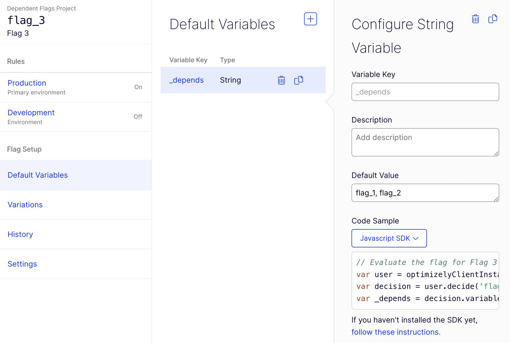

# dependent-flags-demo

A [demonstration](https://koomen.github.io/dependent-flags-demo/) of a simple implementation of "flag dependencies" with Optimizely Full Stack

## Try it out

Check out the demo [here](https://koomen.github.io/dependent-flags-demo/).

The source code is in the [docs](/docs) directory in this repository.

## How it works

[`optimizely_flag_dependencies.js`](/docs/optimizely_flag_dependencies.js) exports one function: `createInstance()`.

This function behaves exactly like the Optimizely Full Stack [`createInstance()` method](https://docs.developers.optimizely.com/experimentation/v4.0.0-full-stack/docs/initialize-sdk-javascript) with one difference:

`optimizely_flag_dependencies.createInstance()` returns an Optimizely client instance with an additional bound method, `decideWithDependencies()`.

`decideDependencies()` takes three parameters: `userContext`, `flagKey`, and `options`. Calling 

```js
  optimizelyClient.decideWithDependencies(user, flagKey, options)
```

is equivalent to the following [`decide()`](https://docs.developers.optimizely.com/experimentation/v4.0.0-full-stack/docs/decide-methods-javascript) method call: 

```js
  user.decide(flagKey, options)
```

with one key difference: `decideWithDependencies(user, flagKey, options)` will check to see if `flagKey` has any dependencies specified via a comma-separated list in the default value of a special `_depends` [flag variable](https://docs.developers.optimizely.com/experimentation/v4.0.0-full-stack/docs/create-flag-variations), like this:



